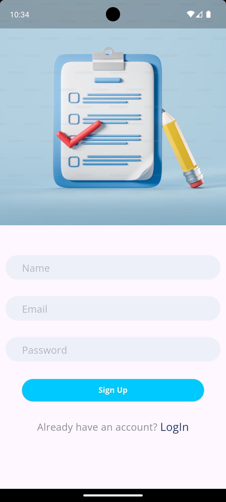
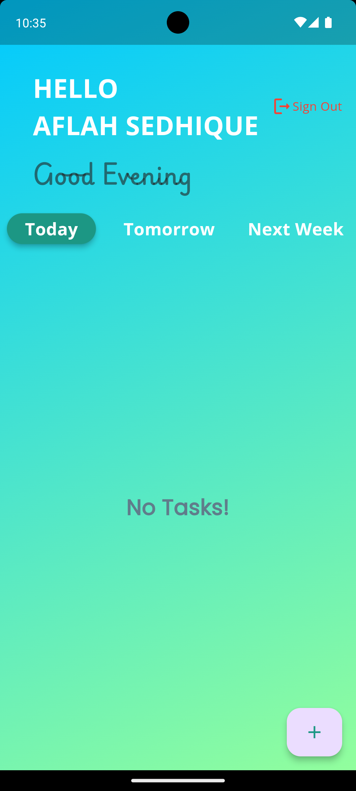
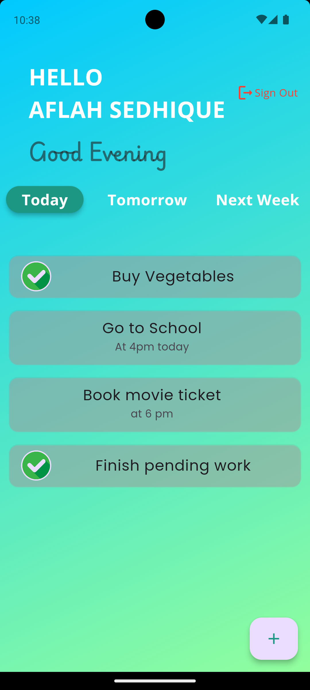
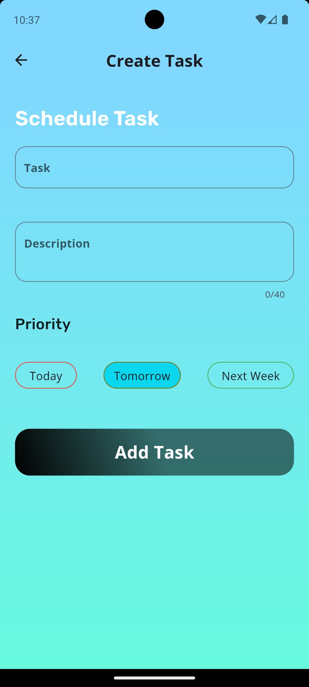
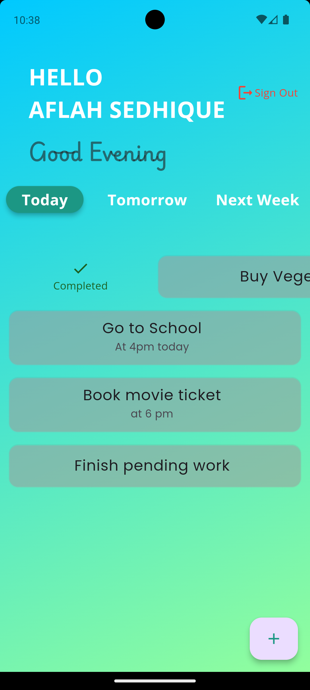
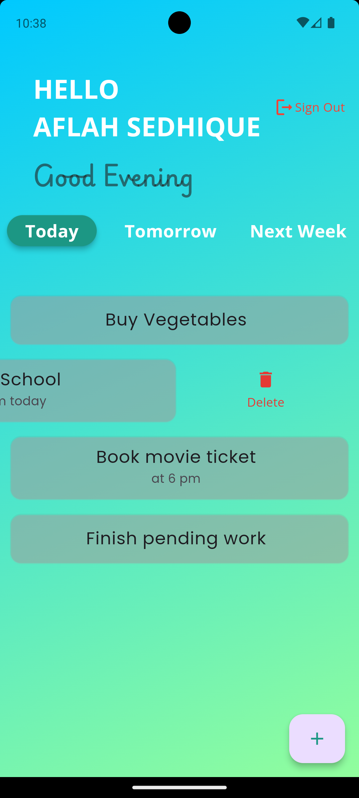

# Futter_Do App

Futter_Do App is a Flutter-based task management application that helps users organize their day-to-day tasks efficiently. It utilizes Firebase for backend services, providing a seamless and responsive task management experience.

## Features

- **User Authentication**: Users can sign up with email and password or log in securely to manage their tasks.
- **Task Management**: Tasks are categorized into "Today", "Tomorrow", and "Next Week" for easy planning and organization.
- **CRUD Operations**: Create, Read, Update, and Delete tasks effortlessly.
- **Task Status Management**: Swipe right to mark tasks as completed or uncompleted and left to delete a task"
- **Intuitive User Interface**: Simple and clean design for smooth user interaction.

## Technologies Used

- **Flutter**: Google's UI toolkit for building natively compiled applications for mobile, web, and desktop from a single codebase.
- **Firebase**: Google's mobile and web application development platform for backend services such as authentication, database, and hosting.

## Getting Started

To get started with Futter_Do App, follow these steps:

1. **Clone the repository**:
- git clone https://github.com/yAflah3100/Flutter_Do.git

2. **Set up Firebase**:
- Create a new Firebase project at [Firebase Console](https://console.firebase.google.com/).
- Add your Android and iOS apps to the Firebase project (follow Firebase setup instructions).
- Download and place `google-services.json` (for Android) and `GoogleService-Info.plist` (for iOS) into the respective app directories (`android/app` and `ios/`) of your cloned project.

3. **Run the app**:
-flutter pub get
-flutter run

## Screenshots

